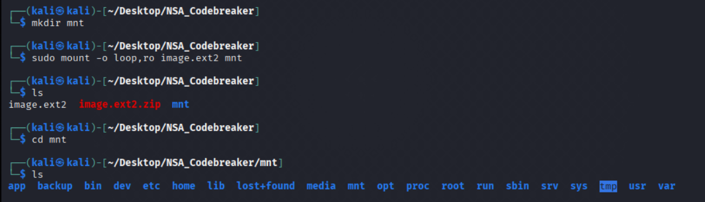
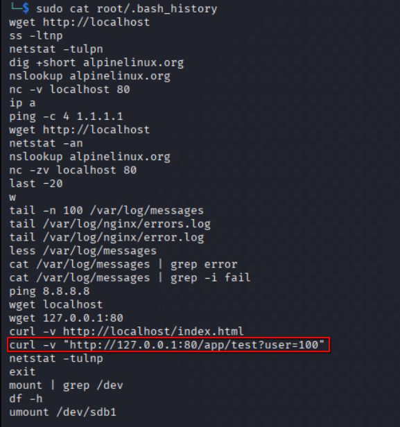
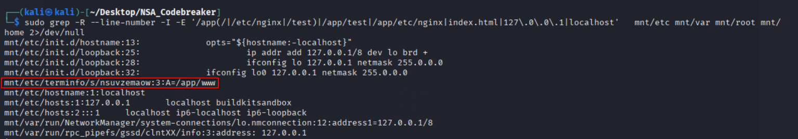

# Task 1 - Getting Started (Forensics)

> You arrive on site and immediately get to work. The DAFIN-SOC team quickly briefs you on the situation. They have noticed numerous anomalous behaviors, such as: tools randomly failing tests and anti-virus flagging on seemingly clean workstations. They have narrowed in on one machine they would like NSA to thoroughly evaluate.

> They have provided a zipped EXT2 image from this development machine. Help DAFIN-SOC perform a forensic analysis on this - looking for any suspicious artifacts.

---

## Downloads

- **zipped EXT2 image:** `image.ext2.zip`

---

## Task

- **Provide the SHA-1 hash of the suspicious artifact.**

---

## Writeup

I started by mounting the EXT2 image in read-only mode so I could safely explore its contents.  

The first place I looked was the root user’s `.bash_history`, since that often tells the story of what happened on the system. The history revealed a **pattern**: lots of local network probing (using `curl`, `wget`, `nc`, `netstat`, etc.), checks against DNS, and even repeated calls to `http://localhost/app/test`. Mixed in were commands to mount `/dev/sdb1` to `/mnt/usb` and edits to the crontab. In other words, whoever was on this box was hammering on a local web service, staging files via USB, and attempting persistence through cron.  

With `/app/test` as a pivot point, I ran a `grep`-ed through the filesystem. This led me to an odd discovery:  

/etc/terminfo/s/nsuvzemaow

This terminfo file references `/app/www`. That's a red flag - terminfo directories are supposed to store compiled terminal capability files, not random application paths. The filename itself looked odd too.  

To confirm, I calculated the SHA-1 hash of the file:  

0068e0c3cba711e775fa374b201d5d04ffcef96c

**Success!** My first ever NSA Codebreaker challenge complete.
