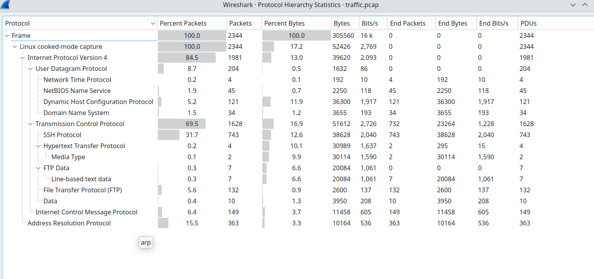
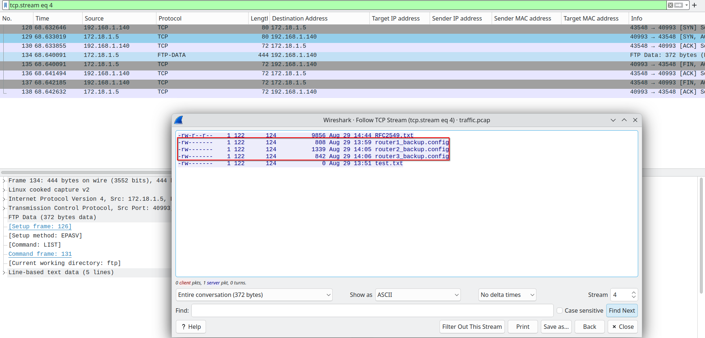
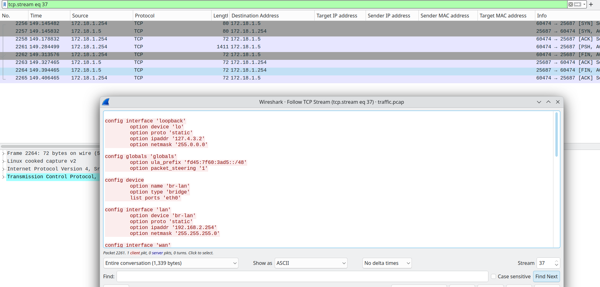
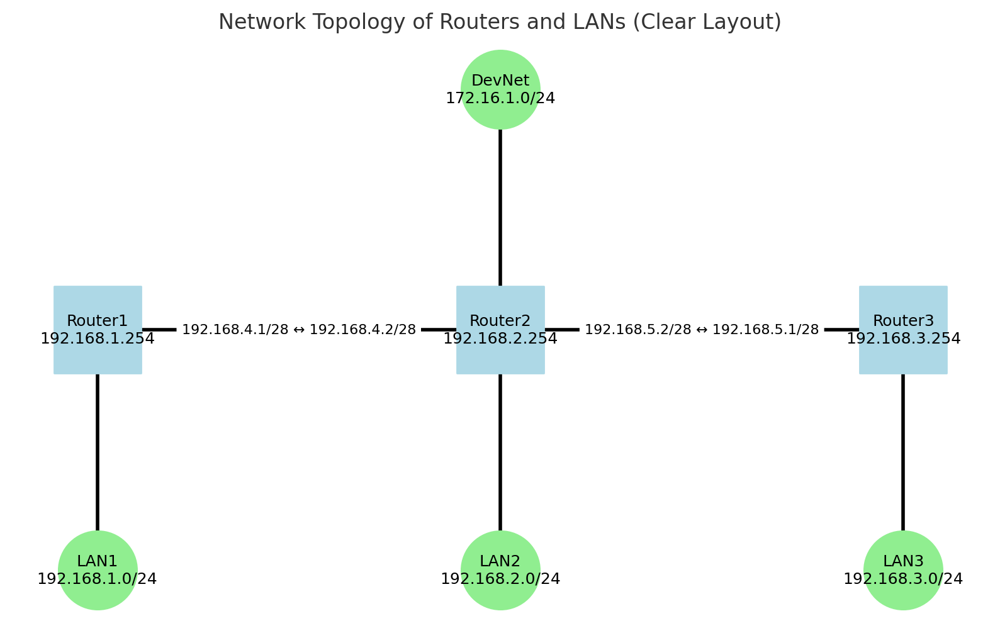
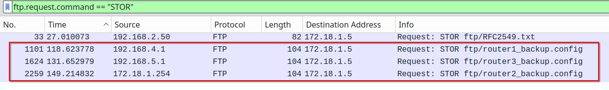
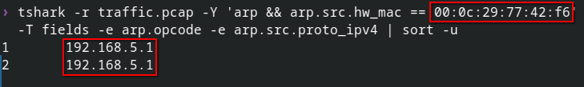
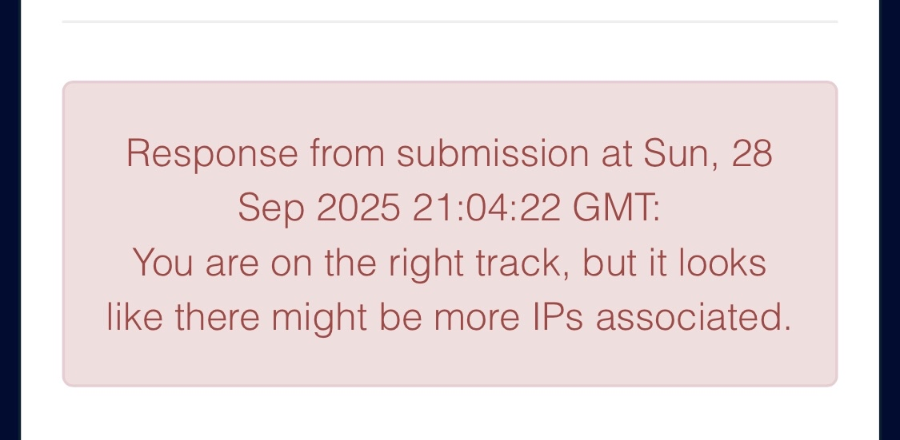
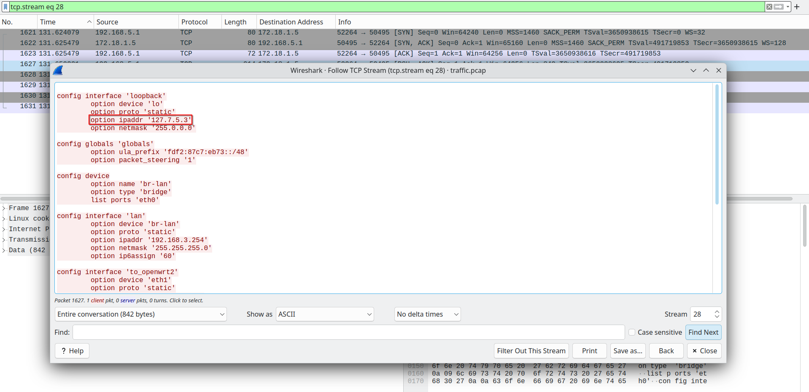

# Task 2 - The hunt continues - (Network Forensics)

> With your help, the team concludes that there was clearly a sophisticated piece of malware installed on that endpoint that was generating some network traffic. Fortunately, DAFIN-SOC also has an IDS which retained the recent network traffic in this segment.

> DAFIN-SOC has provided a PCAP to analyze. Thoroughly evaluate the PCAP to identify potential malicious activity.

---

## Downloads

- **PCAP to analyze:** `traffic.pcap`

---

## Task

- **Submit all the IP addresses that are assigned to the malicious device, one per line.**

---

## Writeup

This task took more work than expected. Upon opening the PCAP, I was greeted by ~2,400 packets consisting of IPv4 and ARP traffic. 

The FTP traffic stood out so I took a closer look.

I saw three files - `router1_backup.config`, `router2_backup.config`, and `router3_backup.config`. It's reasonable to suspect that one of these routers _might_ be our malicious device. FTP transmits control and data in cleartext, so I could read the file contents; it was just a matter of finding the right TCP stream.

I then used a small Python script to generate a network diagram for the most relevant devices. Reading raw packets without context is error-prone, so the diagram helped focus the analysis.

I remained confident the compromised endpoint was one of the routers. Reviewing the packets captured by the IDS, it appeared that the router configuration backups were processed out of order. In TCP streams, they appeared in the order `router1_backup.config` → `router3_backup.config` → `router2_backup.config`, whereas the earlier FTP directory listing showed chronological timestamps.

_Differences between listing timestamps and stream order can occur due to multi-interface capture perspective and buffering, so I treated the ordering as a lead, not a conclusion._

This suggested either Router3’s backup ran earlier than expected or Router2’s ran later. More importantly, frames with `ip.src == 192.168.3.254` had the same L2 sender MAC that ARP-claimed `192.168.5.1`.

Because `192.168.3.254` did not ARP on this segment, the consistent L2 transmitter (`00:0c:29:77:42:f6`) indicates a multihomed device or a routed interface perspective at the sensor.

That MAC ARPs for 192.168.5.1, so it owns 192.168.5.1 on this L2 segment. Because the same NIC (`00:0c:29:77:42:f6`) transmitted frames whose L3 source was `192.168.3.254`, and that NIC ARP-claimed `192.168.5.1`, the evidence supports a **single multihomed device** using both IPs:
- 192.168.5.1 (proven by ARP ownership)
- 192.168.3.254 (proven by exclusive L2 sender)

I submitted this pair of IPs and received the following error:

After I submitted the two IPs, the checker indicated missing addresses, implying Router3 was compromised and had additional IPs. I revisited the `router3_backup.config` retrieved over FTP.

This explains why my first submission failed: the checker wanted **all IPs assigned to the malicious device**, including its loopback address.  
Per RFC 1122, the entire `127.0.0.0/8` block is loopback; `127.7.5.3/8` is valid and never appears on the wire, so it won’t show in the PCAP via ARP or `ip.addr` filters - it is only visible in the router’s configuration.

Putting the evidence together:

- **192.168.5.1** - proven by **ARP ownership** (the MAC `00:0c:29:77:42:f6` requests/replies for this IP on this L2 segment).
- **192.168.3.254** - proven by the **exclusive L2 transmitter** (`sll.src.eth == 00:0c:29:77:42:f6` for all frames with `ip.src==192.168.3.254`).
- **127.7.5.3** - proven by the **router3 config** (loopback; won’t appear in packet-level traffic).

**Success!** Two down, five to go.

