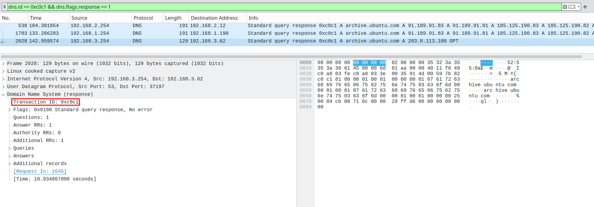
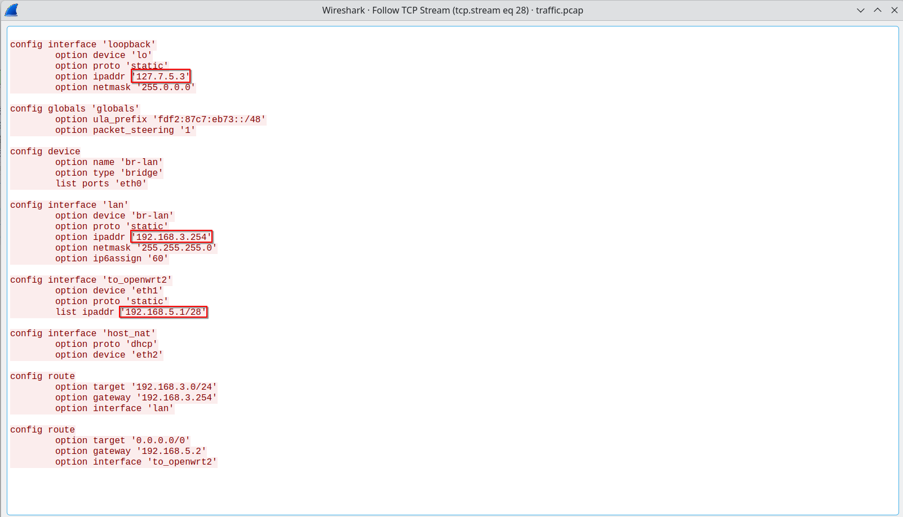

# Task 2 - The hunt continues - (Network Forensics)

> With your help, the team concludes that there was clearly a sophisticated piece of malware installed on that endpoint that was generating some network traffic. Fortunately, DAFIN-SOC also has an IDS which retained the recent network traffic in this segment.

> DAFIN-SOC has provided a PCAP to analyze. Thoroughly evaluate the PCAP to identify potential malicious activity.

---

## Downloads

- **PCAP to analyze:** `traffic.pcap`

---

## Task

- **Submit all the IP addresses that are assigned to the malicious device, one per line.**

---

## Writeup

Upon opening the PCAP in Wireshark, I was greeted by approximately 2,400 packets consisting primarily of IPv4 and ARP traffic.

<p align="center">

</p>

Initial reconnaissance revealed FTP traffic containing three router configuration backup files: `router1_backup.config`, `router2_backup.config`, and `router3_backup.config`. Since FTP transmits data in cleartext, these configurations would be accessible if I could locate the correct TCP streams.

<p align="center">

</p>

<p align="center">

</p>

To better understand the network topology, I used [PcapXray](https://github.com/Srinivas11789/PcapXray) to generate a network diagram showing the most active devices.

<p align="center">

</p>

With three routers in play, I needed a methodical approach to identify which one was compromised. Rather than guessing based on traffic patterns alone, I decided to examine the DNS traffic for anomalies.

### DNS Traffic Analysis

I filtered for DNS traffic using the display filter `dns`, which revealed 36 DNS packets. Narrowing this down to responses only (`dns.flags.response == 1`) showed 19 response packets.

Most DNS responses originated from `192.168.46.2` (the legitimate DNS server), but I noticed something unusual: multiple responses with the same Transaction ID.

Filtering for Transaction ID `0xc0c1` revealed three DNS responses to the same query for `archive.ubuntu.com`:

- **Frame 538** from `192.168.2.254` → Returned legitimate Ubuntu mirror IPs (91.189.91.83, etc.)
- **Frame 1703** from `192.168.1.254` → Returned legitimate Ubuntu mirror IPs (91.189.91.83, etc.)
- **Frame 2028** from `192.168.3.254` → Returned **203.0.113.108**

<p align="center">

</p>

The IP address `203.0.113.108` immediately raised a red flag. The `203.0.113.0/24` subnet is part of TEST-NET-3, a reserved documentation range defined in RFC 5737 that should never appear in production traffic. This was clearly a **poisoned DNS response**.

**Router 3 (192.168.3.254)** had intercepted the DNS query and responded with a malicious IP address, attempting to redirect the client to an attacker-controlled server. This is a classic DNS spoofing attack where a man-in-the-middle device races to answer DNS queries before the legitimate server.

**[You'll need a screenshot showing the packet details of frame 2028 with the 203.0.113.108 response]**

### Extracting Router 3 Configuration

Having identified `192.168.3.254` as the malicious device, I needed to enumerate all IP addresses assigned to it. I returned to the FTP traffic and extracted `router3_backup.config` by following the appropriate TCP stream.

The configuration file revealed three interfaces:
```
config interface 'loopback'
    option device 'lo'
    option proto 'static'
    option ipaddr '127.7.5.3'
    option netmask '255.0.0.0'

config interface 'lan'
    option device 'br-lan'
    option proto 'static'
    option ipaddr '192.168.3.254'
    option netmask '255.255.255.0'

config interface 'to_openwrt2'
    option device 'eth1'
    option proto 'static'
    list ipaddr '192.168.5.1/28'
```

<p align="center">

</p>

### Solution

The malicious device (Router 3) had three IP addresses assigned:

- **192.168.3.254** - LAN interface (`br-lan`)
- **192.168.5.1** - Connection to OpenWRT2 (`eth1`)
- **127.7.5.3** - Loopback interface (`lo`)

Submitting all three addresses successfully completed the challenge.

<p align="center">

</p>

**Success!** Two down, five to go.

### Key Takeaways

- DNS poisoning can be detected by looking for duplicate responses with the same Transaction ID from different source IPs
- Malicious DNS responses often redirect to suspicious IP ranges (in this case, a reserved TEST-NET range)
- Complete enumeration requires examining configuration files, not just live traffic - loopback addresses won't appear in packet captures
- When analyzing network traffic, always verify DNS responses against expected DNS servers
