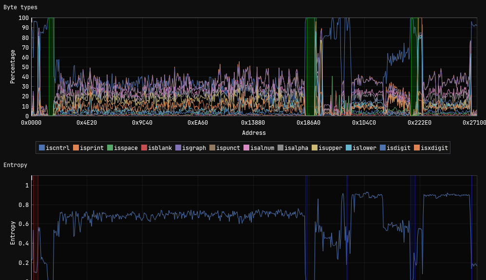

# Task 4 - Unpacking Insight - (Malware Analysis)

> Once back at NSA the team contacts the NSA liaison at FBI to see if they have any information about what was discovered in the configuration data. FBI informs us that the facility registered to host that domain is on a watchlist for suspected criminal activity. With this tip, the FBI acquires a warrant and raids the location. Inside the facility, the server is discovered along with a suspect. The suspect is known to the FBI as a low-level malware actor. During questioning, they disclose that they are providing a service to host malware for various cybercrime groups, but recently they were contacted by a much more secretive and sophisticated customer. While they don't appear to know anything about who is paying for the service, they provide the FBI with the malware that was hosted.

> Back at NSA, you are provided with a copy of the file. There is a lot of high level interest in uncovering who facilitated this attack. The file appears to be obfuscated.

> You are tasked to work on de-obfuscating the file and report back to the team.

---

## Downloads

- **obfuscated file** (`suspicious`)

---

## Task

Submit the file path the malware uses to write a file.

---

## Writeup

Initial file identification revealed the given sample to be a 64-bit Linux executable:
```bash
$ file suspicious 
suspicious: ELF 64-bit LSB pie executable, x86-64, version 1 (SYSV), 
dynamically linked, interpreter /lib64/ld-linux-x86-64.so.2, 
BuildID[sha1]=3fc9729b05add2cba0bddd498f66c8b497060343, 
for GNU/Linux 3.2.0, stripped
```

The binary was stripped, removing symbol information and making our static analysis a bit more challenging.

### Entropy Analysis

To identify potential obfuscation or packing, I performed entropy analysis on the binary. The entropy graph revealed several sections with notably high entropy (approaching 1.0), indicating the presence of encrypted or compressed data:

<p align="center">

</p>


