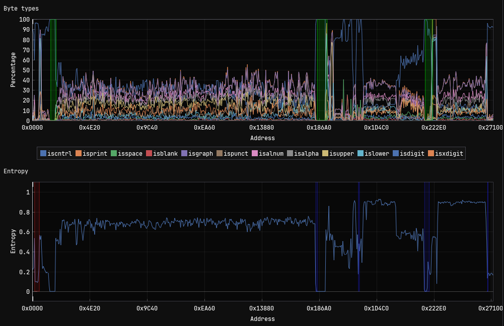
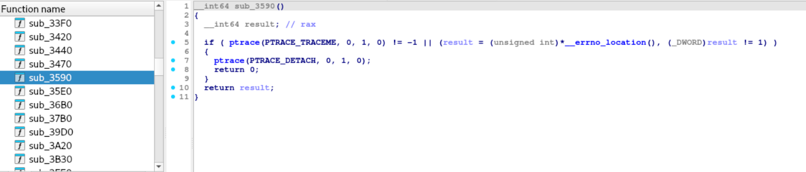
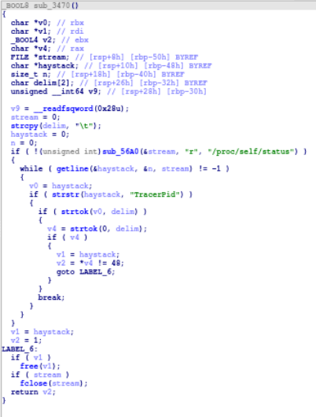
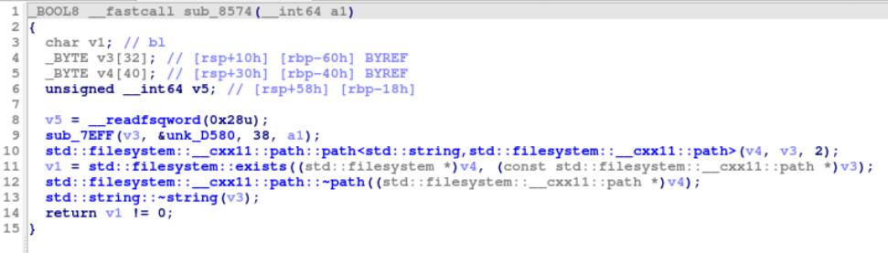
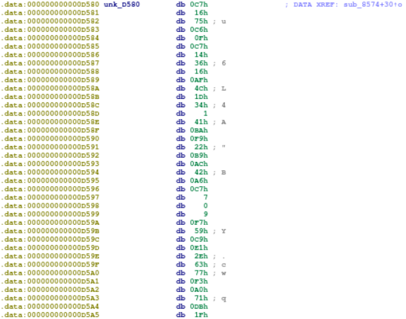
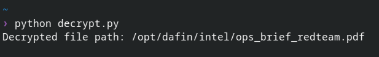

# Task 4 - Unpacking Insight - (Malware Analysis)

> Once back at NSA the team contacts the NSA liaison at FBI to see if they have any information about what was discovered in the configuration data. FBI informs us that the facility registered to host that domain is on a watchlist for suspected criminal activity. With this tip, the FBI acquires a warrant and raids the location. Inside the facility, the server is discovered along with a suspect. The suspect is known to the FBI as a low-level malware actor. During questioning, they disclose that they are providing a service to host malware for various cybercrime groups, but recently they were contacted by a much more secretive and sophisticated customer. While they don't appear to know anything about who is paying for the service, they provide the FBI with the malware that was hosted.

> Back at NSA, you are provided with a copy of the file. There is a lot of high level interest in uncovering who facilitated this attack. The file appears to be obfuscated.

> You are tasked to work on de-obfuscating the file and report back to the team.

---

## Downloads

- **obfuscated file** (`suspicious`)

---

## Task

Submit the file path the malware uses to write a file.

---

## Writeup

Initial file identification revealed the given sample to be a 64-bit Linux executable:
```bash
$ file suspicious 
suspicious: ELF 64-bit LSB pie executable, x86-64, version 1 (SYSV), 
dynamically linked, interpreter /lib64/ld-linux-x86-64.so.2, 
BuildID[sha1]=3fc9729b05add2cba0bddd498f66c8b497060343, 
for GNU/Linux 3.2.0, stripped
```

The binary was stripped, removing symbol information and making our static analysis a bit more challenging.

### Entropy Analysis

To identify potential obfuscation or packing, I performed entropy analysis on the binary using ImHex. The entropy graph revealed several sections with notably high entropy (approaching 1.0), indicating the presence of encrypted or compressed data:

<p align="center">

</p>

The high entropy sections at addresses 0x186A0, 0x1D4C0, and 0x222E0 suggested the malware contained encrypted payloads that would be unpacked during runtime.

---

### Discovering Anti-Debug Mechanisms

Initial attempts to run the binary under GDB revealed an anti-debugging trap:
```bash
$ gdb ./suspicious
(gdb) run
```

<p align="center">

</p>

The program immediately crashed with a SIGSEGV (segmentation fault) at address `0x55555555765a`. Examining the instruction at this location revealed:
```assembly
0x55555555765a    mov    DWORD PTR ds:0x0, 0x0
```

This instruction attempts to write to NULL (address 0x0), an intentional crash mechanism.

### Identifying Additional Anti-Debug Functions

However, simply NOPing out the crash instruction proved insufficient. Through static analysis in IDA, I examined the binary to understand the full anti-debug chain and discovered two additional protection mechanisms that needed to be bypassed.

#### Mechanism 1: ptrace Detection (sub_3590)

Located at address `0x3590`, this function uses `ptrace(PTRACE_TRACEME)` to detect debugger presence:
```c
__int64 sub_3590()
{
  __int64 result;
  if ( ptrace(PTRACE_TRACEME, 0, 1, 0) != -1 || 
       (result = (unsigned int)*__errno_location(), (_DWORD)result != 1) )
  {
    ptrace(PTRACE_DETACH, 0, 1, 0);
    return 0;  // No debugger
  }
  return result;  // Debugger detected (returns non-zero)
}
```

When a process is already being traced by a debugger, `PTRACE_TRACEME` fails with `errno = EPERM (1)`. The function returns a non-zero value if a debugger is detected, which triggers the anti-debug chain.

<p align="center">

</p>

#### Mechanism 2: TracerPid Check (sub_3470)

Located at address `0x3470`, this function reads `/proc/self/status` to check the `TracerPid` field:
```c
_BOOL8 sub_3470()
{
  // Opens /proc/self/status
  if ( !(unsigned int)sub_56A0(&stream, "r", "/proc/self/status") )
  {
    while ( getline(&haystack, &n, stream) != -1 )
    {
      if ( strstr(haystack, "TracerPid") )
      {
        if ( strtok(v0, delim) )
        {
          v4 = strtok(0, delim);
          if ( v4 )
          {
            v2 = *v4 != 48;  // Returns true if TracerPid != '0'
            // ...
          }
        }
      }
    }
  }
  return v2;
}
```

When a debugger is attached, the `TracerPid` value in `/proc/self/status` is non-zero (the PID of the debugging process). This function returns true when debugging is detected.

<p align="center">

</p>

---

### Anti-Debug Bypass

To enable full dynamic analysis, I created a simple Python script to patch all three anti-debug mechanisms:
```python
with open('suspicious', 'rb') as f:
    data = bytearray(f.read())

# Patch sub_3590 (ptrace check) to immediately return 0
offset = 0x3590 + 4  # Skip endbr64 instruction
data[offset:offset+3] = b'\x31\xc0\xc3'  # xor eax, eax; ret

# Patch sub_3470 (TracerPid check) to immediately return 0
offset2 = 0x3474
data[offset2:offset2+3] = b'\x31\xc0\xc3'  # xor eax, eax; ret

# Patch NULL pointer trap at 0x765a
offset3 = 0x765a
data[offset3:offset3+10] = b'\x90' * 10  # NOP sled

with open('suspicious_patched3', 'wb') as f:
    f.write(data)

print("Patched all anti-debug checks")
```

The patches work by:
- Replacing both detection functions with `xor eax, eax; ret` to force them to always return 0 (no debugger detected)
- NOPing out the NULL pointer trap to prevent the crash

---

## Dynamic Analysis and Payload Extraction

With the anti-debug protections bypassed, I proceeded with dynamic analysis using GDB. Since the challenge specifically asks for "the file path the malware uses to write a file," I set a catchpoint on the `write` system call to monitor all write operations:
```bash
$ gdb ./suspicious_patched3
(gdb) catch syscall write
Catchpoint 1 (syscall 'write' [1])
(gdb) run
(gdb) continue
```

Upon the first continue, I hit a write operation. To understand what was being written, I needed to examine the system call arguments. On x86-64 Linux, system calls pass arguments through registers according to the following convention:

- `rdi` = first argument
- `rsi` = second argument  
- `rdx` = third argument

For the `write` system call specifically, the signature is `write(int fd, const void *buf, size_t count)`, which maps to:

- `rdi` = file descriptor (where to write)
- `rsi` = buffer pointer (what to write)
- `rdx` = byte count (how much to write)

Examining these registers:
```gdb
(gdb) info registers rdi rsi rdx
rdi            0x3                 0x3
rsi            0x555555590390      0x555555590390
rdx            0xcee8              0xcee8
```

This revealed the malware was writing to file descriptor 3, with 0xcee8 (52,968) bytes of data from memory address 0x555555590390. The large size suggested this was payload data rather than typical logging output.

To identify what file descriptor 3 represented, I checked the process's file descriptors while it was paused in the debugger:
```bash
(gdb) shell ls -la /proc/$(pgrep suspicious)/fd/
total 0
dr-x------ 2 kali kali  4 Nov 20 21:01 .
dr-xr-xr-x 9 kali kali  0 Nov 20 21:01 ..
lrwx------ 1 kali kali 64 Nov 20 21:01 0 -> /dev/pts/0
lrwx------ 1 kali kali 64 Nov 20 21:01 1 -> /dev/pts/0
lrwx------ 1 kali kali 64 Nov 20 21:01 2 -> /dev/pts/0
lrwx------ 1 kali kali 64 Nov 20 21:01 3 -> '/memfd: (deleted)'
```

<p align="center">

</p>

File descriptor 3 pointed to `/memfd: (deleted)` - a memory-backed file. This technique allows the malware to unpack a payload into memory without writing to disk, avoiding file-based detection. I extracted this data while the program was paused:
```gdb
(gdb) dump binary memory /tmp/extracted.bin 0x555555590390 0x555555590390+0xcee8
```

---

### Analyzing the Unpacked Payload

The extracted payload was itself an ELF binary:
```bash
$ file /tmp/extracted.bin
/tmp/extracted.bin: ELF 64-bit LSB shared object, x86-64, version 1 (SYSV), 
dynamically linked, BuildID[sha1]=69d0667eed34a355fc78fbe68a7eed42897947c1, stripped
```

Loading this unpacked payload into IDA revealed the true functionality. The payload's `run()` function showed an interesting pattern:
```c
unsigned __int64 run()
{
  _BYTE v2[264]; // RC4 state
  v3 = __readfsqword(0x28u);
  
  sub_7C8E(v2, "skibidi", 7);  // Initialize RC4 with key "skibidi"
  
  if ( (unsigned __int8)sub_8574(v2) == 1
    && (unsigned __int8)sub_8666(v2) == 1
    && (unsigned __int8)sub_86F8() == 1
    && (unsigned __int8)sub_8771() == 1
    && (unsigned __int8)sub_8795(v2) == 1
    && (unsigned __int8)sub_8A0F(v2) == 1 )
  {
    sub_7F5D(v2);
  }
  
  return v3 - __readfsqword(0x28u);
}
```

<p align="center">
 [SCREENSHOT: IDA decompilation of run() function]
</p>

The function initializes an RC4 cipher state with the key `"skibidi"` and then calls multiple check functions, each of which decrypts strings using the RC4 state.

---

### RC4 Decryption and File Path Discovery

Each check function followed a similar pattern, calling `sub_7EFF` (the RC4 decryption routine) with encrypted data:
```c
_BOOL8 __fastcall sub_8574(__int64 a1)
{
  _BYTE v3[32];
  _BYTE v4[40];
  
  sub_7EFF(v3, &unk_D580, 38, a1);  // Decrypt 38 bytes from 0xD580
  std::filesystem::__cxx11::path::path<std::string>(v4, v3);
  v1 = std::filesystem::exists((std::filesystem *)v4);
  
  return v1 != 0;
}
```

<p align="center">

</p>

This function decrypts data from address `0xD580` and checks if that path exists on the filesystem. Examining the encrypted data in IDA:

<p align="center">
 [SCREENSHOT: IDA showing hex bytes at 0xD580]
</p>

The encrypted bytes at `0xD580` (38 bytes):
```
C7 16 75 C6 0F C7 14 36 16 AF 4C 1D 34 01 41 BA 
F9 22 B9 AC 42 A6 C7 07 00 09 F7 59 C9 E1 2E 63 
77 F3 A0 71 DB 1F
```

To decrypt this, I implemented the following in Python:
```python
# RC4 is a stream cipher that generates pseudo-random bytes based on a key.
# The malware used RC4 to encrypt strings. We found the key "skibidi" and 
# encrypted data by reverse engineering the unpacked payload.

def rc4_init(key):
    # Initialize RC4 by creating a permutation of 0-255 scrambled by the key.
    # This is the Key Scheduling Algorithm (KSA).
    
    number_list = list(range(256))
    scramble_index = 0
    
    for position in range(256):
        # Update scramble index based on current value and key byte
        scramble_index = (scramble_index + number_list[position] + key[position % len(key)]) % 256
        # Swap values to scramble the list
        number_list[position], number_list[scramble_index] = \
            number_list[scramble_index], number_list[position]
    
    return {'number_list': number_list, 'counter_i': 0, 'counter_j': 0}

def rc4_byte(state):
    # Generate one keystream byte. State is modified on each call.
    # This is the Pseudo-Random Generation Algorithm (PRGA).
    
    number_list = state['number_list']
    
    # Increment counter_i
    state['counter_i'] = (state['counter_i'] + 1) % 256
    pos_i = state['counter_i']
    
    # Update counter_j based on current permutation value
    state['counter_j'] = (state['counter_j'] + number_list[pos_i]) % 256
    pos_j = state['counter_j']
    
    # Swap values at both positions
    number_list[pos_i], number_list[pos_j] = number_list[pos_j], number_list[pos_i]
    
    # Generate output byte by looking up permutation at sum of both values
    lookup_index = (number_list[pos_i] + number_list[pos_j]) % 256
    return number_list[lookup_index]


# Initialize RC4 with key "skibidi" found in malware's run() function
cipher_state = rc4_init(b"skibidi")

# Encrypted data extracted from address 0xD580 in unpacked payload (38 bytes)
# This was passed to sub_7EFF (RC4 decryption) by sub_8574()
encrypted_data = bytes.fromhex('C71675C60FC7143616AF4C1D340141BAF922B9AC42A6C7070009F759C9E12E6377F3A071DB1F')

# Decrypt by XORing each byte with keystream
# XOR operation reverses encryption: ciphertext ^ keystream = plaintext
decrypted_data = bytes([byte ^ rc4_byte(cipher_state) for byte in encrypted_data])

print(f"Decrypted file path: {decrypted_data.decode()}")
# Output: /opt/dafin/intel/ops_brief_redteam.pdf
```

Running this script revealed the file path the malware uses:
```
Decrypted file path: /opt/dafin/intel/ops_brief_redteam.pdf
```

<p align="center">
 [SCREENSHOT: Terminal showing Python script output]
</p>

---

### Conclusion

Through a combination of static and dynamic analysis, I successfully de-obfuscated the malware sample by:

1. Identifying and bypassing multiple anti-debug mechanisms (ptrace, TracerPid, NULL trap)
2. Using dynamic analysis to extract the memory-mapped payload
3. Reverse engineering the unpacked payload to discover RC4 encryption
4. Implementing RC4 decryption to recover the target file path

**Answer:** `/opt/dafin/intel/ops_brief_redteam.pdf`
